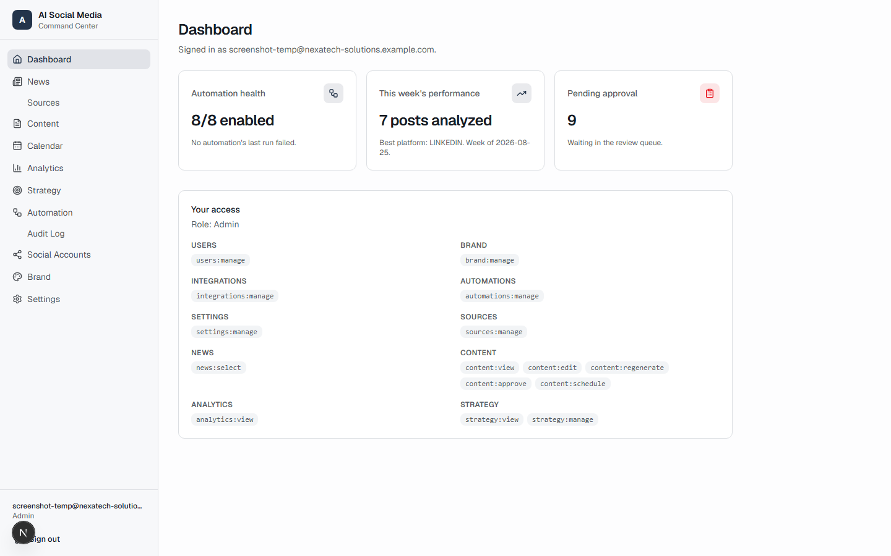
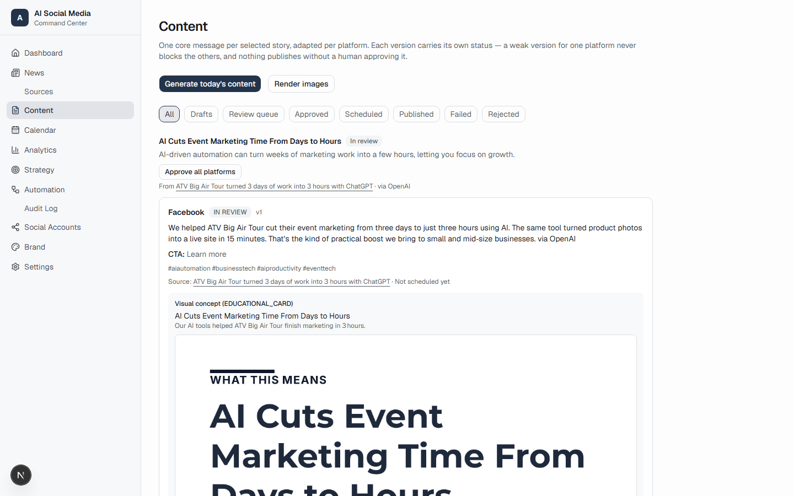
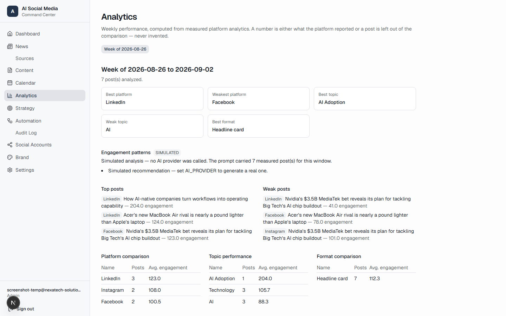

# AI Social Media Automation Platform


An internal operations platform that runs a company's social media program
end to end: it researches industry news, drafts brand-aligned posts for
Facebook, Instagram and LinkedIn, renders a branded static image for each
one, routes every version through human approval, publishes on schedule, and
closes the loop with real analytics and AI-generated weekly strategy
recommendations — all under human control, with nothing published without
sign-off.

It is built around one non-negotiable rule: **the system never fabricates a
result.** A simulated publish is labelled `MOCK`, never shown as live. A
metric a platform doesn't return is stored as the literal word
`UNAVAILABLE`, never a fabricated zero. A strategy recommendation always
cites the real, stored numbers behind it. That discipline — honest about
what's real, what's simulated, and what genuinely isn't available — runs
through every layer of the codebase.

## Screenshots

| Dashboard | Content Review Queue | Analytics |
|---|---|---|
|  |  |  |

*(Screenshots pending — drop `dashboard.png`, `content-review.png` and
`analytics.png` into `docs/screenshots/` to populate this table.)*

## Key Features

**Editorial pipeline**
- Configurable RSS news sources, deduplicated and normalized on ingest
- AI relevance, credibility and social-potential scoring produces a daily shortlist
- A human picks exactly three stories a day — the system never posts on its own agenda
- AI drafts a platform-tailored version for each of Facebook, Instagram and LinkedIn from one core message, with its own tone, length and hashtags per platform
- Branded static cards rendered server-side (Satori → SVG → PNG), no headless browser
- Per-platform approval workflow — one weak version never blocks the other two

**Publishing & scheduling**
- Real integrations against Meta's Graph API and LinkedIn's REST API, each behind a mock mode so nothing reaches a live account until deliberately switched on
- Timezone-aware calendar with double-post conflict detection
- Idempotent publishing: a retry can never create a duplicate post
- OAuth tokens encrypted at rest (AES-256-GCM), never logged, never shown

**Analytics & strategy**
- Real platform metrics synced automatically post-publish — never fabricated where a platform doesn't provide a number
- Weekly AI-written performance reports: best/weakest posts, platform and topic comparisons, all computed only from what was actually measured
- Versioned AI strategy recommendations, each one citing the evidence behind it, with full history retained

**Operations**
- Automation Control Center: every scheduled workflow's status, run history, a manual re-run, and an on/off switch
- Full audit trail of every consequential action
- Role-based access control (Admin / Manager / Social Manager) enforced server-side, never trusted from the client
- Firestore Security Rules default-closed, opened collection by collection
- Nonce-based Content-Security-Policy, HMAC-signed webhooks, and a dependency/security audit baked into the workflow

## Architecture

```
RSS feeds ──▶ Ingest & normalize ──▶ AI ranking ──▶ Daily shortlist ──▶ Slack
                                                                          │
                                                            Human picks 3 stories
                                                                          │
                                                                          ▼
                                          AI content generation (per platform)
                                                                          │
                                                          Branded card rendering
                                                                          │
                                                        Human review & approval
                                                                          │
                                                            Calendar & scheduling
                                                                          │
                                          ┌────────────── Publishing ─────┴────────────────┐
                                          ▼                                                 ▼
                                 Facebook / Instagram                                  LinkedIn
                                          │                                                 │
                                          └──────────────────┬──────────────────────────────┘
                                                               ▼
                                                   Analytics sync (real, per platform)
                                                               │
                                                   Weekly AI performance report
                                                               │
                                                   Versioned AI strategy recommendations
```

**Application layer** — Next.js App Router. Server Components and Server
Actions do all privileged work (Firestore Admin SDK, encryption, external
API calls); the browser only ever talks to Firebase Auth directly and to
this app's own signed endpoints. Firestore Security Rules default-deny and
are opened collection by collection, so the client's own reach is narrow
even before the server-side checks run.

**Orchestration** — n8n runs the schedule (daily research, weekly reports,
publishing ticks) and calls this app's webhooks, each authenticated by an
HMAC signature over the raw request body rather than a bearer token. The
app never hands n8n a database or storage credential — it only ever
receives a signed trigger and does the privileged work itself.

**Provider abstraction** — every external integration (AI, social
publishing, analytics, Slack) sits behind a small interface with a real
adapter and a deterministic mock adapter, selected by an environment
variable. Development, tests and CI run entirely on mocks; a real account
is never touched until a provider is switched on deliberately.

## Tech Stack

| Layer | Technology |
|---|---|
| Framework | Next.js 16 (App Router, Server Components & Actions) |
| Language | TypeScript (strict mode) |
| Styling | Tailwind CSS v4, shadcn/ui |
| Database & Auth | Firebase — Firestore + Authentication |
| Media storage | Cloudinary (signed server-side uploads) |
| Image rendering | Satori + resvg (SVG → PNG, no headless browser) |
| AI | Groq (behind a provider abstraction — swappable) |
| Automation | n8n (signed webhook orchestration) |
| Validation | Zod, end to end |
| Testing | Vitest (unit/integration), Playwright (e2e), Firebase Emulator Suite (security rules) |
| Notifications | Slack Web API |

## Getting Started

### Prerequisites

- Node.js 20.9+ and npm
- A Firebase project (Firestore + Authentication enabled)
- A Cloudinary account
- The Firebase CLI, for running the security rules and e2e test suites

### Installation

```bash
npm install
cp .env.example .env.local   # then fill in real values
```

`.env.local` is git-ignored and must never be committed. Two groups of
variables matter: `NEXT_PUBLIC_*` values are safe to expose in the browser
bundle; everything else is server-only, enforced at the type level by the
`server-only` package. `FIREBASE_ADMIN_PRIVATE_KEY` is pasted with literal
`\n` sequences — the env schema unescapes them. `TOKEN_ENCRYPTION_KEY` must
be 64 hex characters (32 bytes): generate one with `openssl rand -hex 32`.

### Firebase project setup

The Firestore database has to exist before `npm run verify:services` can
pass — creating the project alone isn't enough. Then confirm its actual ID:

```bash
firebase firestore:databases:list --project <project-id>
```

A project's first database is usually `(default)` (parentheses included —
that's the literal name). If yours is anything else, set both
`FIREBASE_DATABASE_ID` and `NEXT_PUBLIC_FIREBASE_DATABASE_ID` to match it,
and update `firebase.json`'s `database` field too, or rules will deploy to a
database that doesn't exist.

Enable Email/Password sign-in under Authentication → Get started, then
create the first administrator account:

```bash
npm run provision:user -- --email you@company.com --role ADMIN --name "Your Name"
```

There is no signup route by design — every account is provisioned this way.

### Run it

```bash
npm run dev
```

## Available Scripts

| Command | What it does |
|---|---|
| `npm run dev` | Start the development server |
| `npm run build` / `npm run start` | Production build and start |
| `npm run verify` | The full offline quality gate — typecheck, lint, format check, unit tests, build |
| `npm run test` | Unit and integration tests (Vitest) |
| `npm run test:rules` | Firestore Security Rules tests against the emulator |
| `npm run test:e2e` | Playwright tests that need no credentials |
| `npm run test:e2e:auth` | Full credentialed e2e suite against the Firebase emulators |
| `npm run verify:services` | One-off live check that Firestore and Cloudinary credentials actually work |
| `npm run emulators` | Start the Firestore + Auth emulators |
| `npm run provision:user` | Create, update, or disable an account |
| `npm run seed:sources` | Seed a starter set of verified news feeds |

## Testing

- **510 unit/integration tests** (Vitest) covering business logic, validation, and every provider adapter through its mock
- **37 Firestore Security Rules tests** against the Firebase Emulator Suite — both allow and deny cases
- **86 credentialed end-to-end tests** (Playwright) against real Firebase Auth/Firestore emulators, covering every role and every screen
- No test ever calls a live external API — every provider (AI, social platforms, Slack) is exercised through its deterministic mock

## Documentation

Every module has a detailed implementation writeup — what was built, what
was verified against official documentation before being trusted, and why —
in [`docs/`](docs). The full product specification that governs every
decision in this repository lives in
[`AI-Social-Media-Automation-System.md`](AI-Social-Media-Automation-System.md).

## Notable Engineering Decisions

- **Provider abstraction everywhere.** AI, social publishing, and analytics are never called directly — always through an interface with a real adapter and a mock, so the whole system runs deterministically offline and a real account is never touched by accident.
- **Two independent authorization layers.** Edge middleware redirects on a missing session cookie for UX only; every actual authorization check runs server-side against the Admin SDK, because middleware cannot verify a session cookie's authenticity.
- **Idempotent publishing.** Approval state, scheduled state, previous attempts and the platform's own returned post ID are all re-checked inside one transaction immediately before publishing, so a retry can never create a duplicate post.
- **Honest data, always.** A simulated action is labelled `MOCK` in the data itself, not just the UI. A metric a platform doesn't return is `UNAVAILABLE`, never zero. An AI recommendation is skipped outright rather than invented when there's nothing to base it on.

---

*This is a private/portfolio project — not open for public contribution.*
